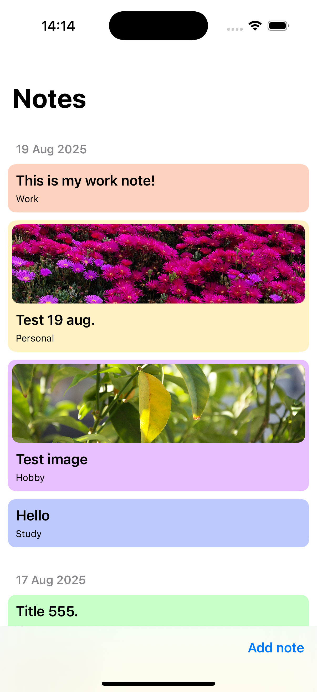
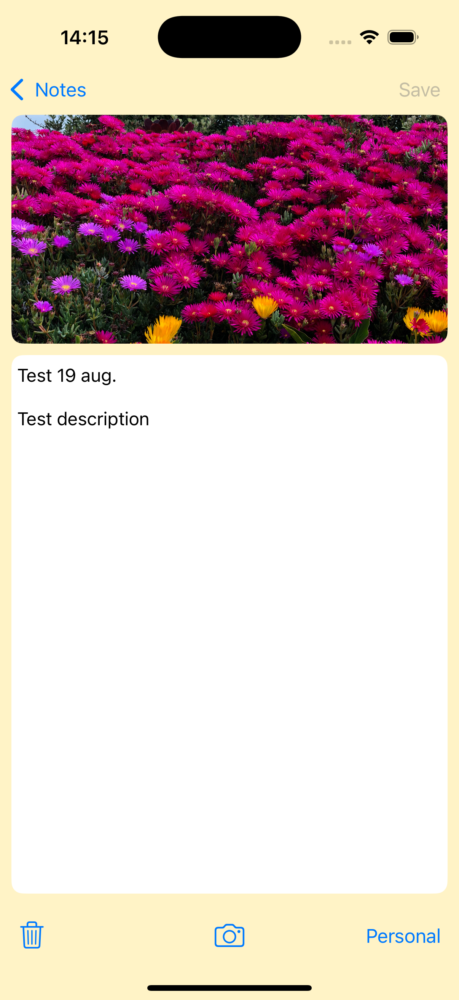
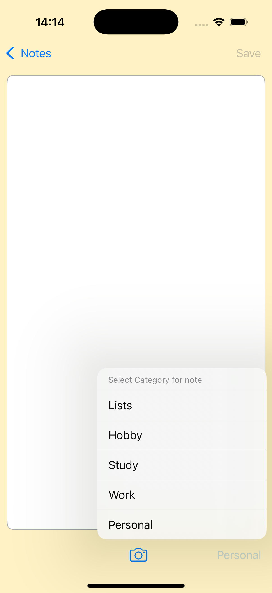

# Notes App

## Description
**Notes-App** is a simple iOS application for creating and storing notes. The project uses **UIKit**, **CoreData**, and **FileManager** to manage notes, save data, and store local images on the user's device.

  
---

## Features
- Create, view, and store notes  
- Navigation via `UINavigationController`  
- Data storage using `CoreData`  
- Image storage using `FileManager`  
- Simple **MVVM** architecture
- Assign a category to each note, with a unique color displayed on the main screen cell and the note detail screen  
